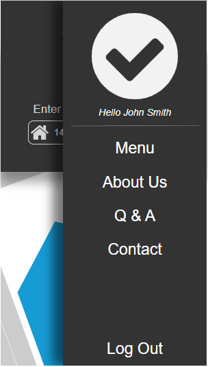
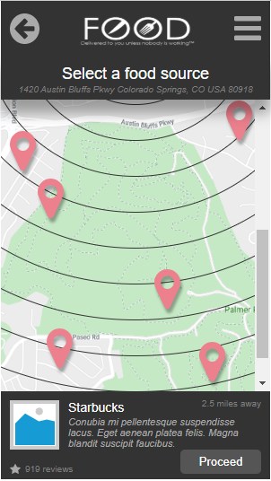
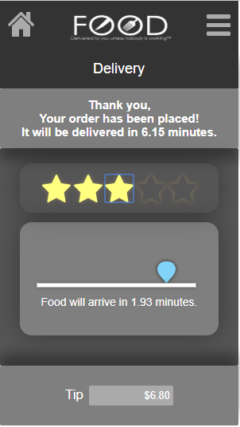

# User-interface / user-experience project using Axure
Axure is a wireframe and prototyping tool for the development of interactive user interfaces that can be later implemented into a real application. For this project, the assignment was to create a food ordering application that users can interact with to perform a variety of tasks. The tasks were graded solely on the overall user experience when using the application, and the visual design principles that go into the design. 

Because this application was created in Axure, it is hosted in the Axure database [here](https://eaa46o.axshare.com/).
It can also be accessed using the following link www.simewu.com/ux-ui-ordering-app.

Thanks for viewing, have a great day.
